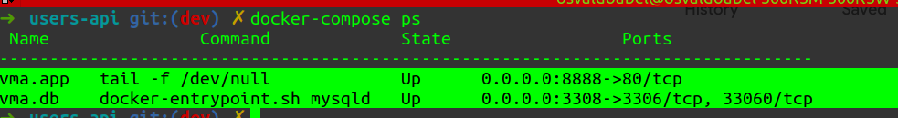

# Documentation

[]()

. [Introduction](#introduction)  
. [Project Requirements](#requirements)  
. [Api Endoints](#api-endpoints)  
. [TO DO](#to-do)  


# Introduction
 In this repository, we have everything we need to run this **User Api** project using [docker containers](http://docker.com). Below you can see a basic guide to learn how to run it in your local environment.

In this project we create an *API* using [hexagonal archiecture or ports & adpters architecture](https://en.wikipedia.org/wiki/Hexagonal_architecture_(software)) resulting in a robust and flexible project. So it's  pretty simple to add new features, new Entities, etc. Including if we need to add a **console adapter**, the **application layers** will keep intact.

### Requirements

You just need to have [Git ](https://docs.docker.com/install) and [Docker ](https://docs.docker.com/install) installed running in your machine.

#### Clone Project

```bash
$ git clone https://gitlab.com/osvaldoabel/user-api project-name
```
#### Run Project

```bash
# Get into the cloned repo
$ cd project-name

# Build and start containers, 
$ docker-compose up -d --build 
```
 I recomend to have a look at [*.docker/app/entrypoint.sh*](./.docker/app/entrypoint.sh) file to understand that it can take a bit of time when starting the vma.app container, because it runs *Tests *, downloads every dependencies and finally runs the webserver.

```bash
# You can also verify containers status
$ docker-compose ps
```

This will output near to this:

[]() 

```bash
  # get into vma.app to do anything you might need
$ docker exec -it vma.app bash
```


## API Endpoints 
- #### CREATE User

```
# /v1/users

curl -X POST \
  http://localhost:8888/v1/users \
  -H 'Content-Type: application/json' \
  -d '{
    "name": "User 3 - updated",
    "email": "updated3@example.com",
    "status": "active",
    "address": "My Address",
    "password": "semsenha",
    "age": 28
}'
```

- #### UPDATE User

```
# /v1/users/fa9f88f4-4fe8-46d8-afb3-85886c50ec4c/update

curl -X PUT \
  http://localhost:8888/v1/users/fa9f88f4-4fe8-46d8-afb3-85886c50ec4c/update \
  -H 'Content-Type: application/json' \
  -d '{
    "name": "User X - updated",
    "email": "updated3@example.com",
    "status": "active",
    "address": "My new Address",
    "password": "123Pass",
    "age": 50
}'
```
- #### LIST users (Paginated)

```
# /v1/users?per_page=10

curl -X GET \
  http://localhost:8888/v1/users \
  -H 'Content-Type: application/json' \
  -d '{
    "name": "User 3 - updated",
    "email": "updated3@example.com",
    "status": "active",
    "address": "My Address",
    "password": "semsenha",
    "age": 35
}'
```

- #### SHOW User

```
#/v1/users/fa9f88f4-4fe8-46d8-afb3-85886c50ec4c 

curl -X GET http://localhost:8888/v1/users/fa9f88f4-4fe8-46d8-afb3-85886c50ec4c -H 'Content-Type: application/json' \
  -d '{
    "name": "User 3 - updated",
    "email": "updated3@example.com",
    "status": "active",
    "address": "My Address",
    "password": "semsenha",
    "age": 35
}'
```

- #### DELETE User

```
#/v1/users/fa9f88f4-4fe8-46d8-afb3-85886c50ec4c 

curl -X DELETE http://localhost:8888/v1/users/fa9f88f4-4fe8-46d8-afb3-85886c50ec4c -H 'Content-Type: application/json'
```

# To DO
- Caching (With [redis](https://redis.io/) )
- Authentication / Authorization
- More [Advanced Logging system]()

**NOTE:** It Would be interesting if we persisted our logs into Elasticsearch. 
 Q: How would it be?
 A: We send each log into a RabbitMq queue (or another messaging system) then another service (a logger microservice) retrieves it and just save it to elasticsearch.  
 **pros**:  
 . You can serve as many microservice you'll need
 . You'll have an Asynchronous system (very good most of time. )
 . etc.  
 **Cons**: 
 . Increases project complexity

 **NOTE 2**
This is just a hypothetical scenarios. 
If your project will not grow to this magnitude, you don't need to implement this way.

Developed by [Osvaldo Abel](https://gitlab.com/osvaldoabel)
